# 个人中心（dashboard.html）布局与 UI 优化说明

优化对象：`http://localhost:3000/dashboard.html`
涉及文件：`public/dashboard.html`、`public/css/style.css`、`public/js/app.js`、`server.js`
截图目录：`docs/dashboard-ui/`

---

## 一、优化目标

1. 视觉吸引力与项目既有设计语言（烬潮 · B 站风格：`--primary:#fb7299`、渐变按钮、玻璃拟态导航、8px 圆角与 4px 间距刻度）保持一致；
2. 重建信息层级，让「我是谁 / 我有什么数据 / 我要去哪 / 我要做什么」按顺序呈现；
3. 增强交互反馈（按钮状态、过渡动效、键盘可达、响应式适配）；
4. 保证 Chrome / Firefox / Safari / Edge 最新版本正常显示；
5. 优化关键渲染路径，消除主题闪烁与布局抖动；
6. 交付完整 HTML / CSS / JS、优化前后对比截图、本说明文档。

---

## 二、优化前问题诊断

| # | 问题 | 具体表现 |
|---|---|---|
| 1 | 导航与危险操作混排 | 8 个按钮（返回首页、4 个内容入口、退出登录、注销账号）单行平铺，权重完全相同，「注销账号」与「我的收藏」视觉等价，误点风险高 |
| 2 | 无信息概览 | 页面不展示投稿数、粉丝数、获赞数等任何数据，用户进入后没有「我的账号状态」认知 |
| 3 | 四个表单等权堆叠 | 个人资料、发布文章、上传视频、上传文件四个区块纵向堆叠，首屏即开始堆表单，页长达 1804px（1093px 视口下） |
| 4 | 交互语义弱 | 导航入口用 `<button data-href>` + JS 跳转实现，不支持中键新标签、无 `href` 可复制 |
| 5 | 未复用设计令牌 | 操作按钮另起一套 `.dashboard-action-btn` 样式（`border-radius:10px`、独立 hover），与全站 `.btn` 体系不一致；危险色硬编码 `#e74c3c` |
| 6 | 深色模式缺陷 | `.message` 硬编码浅色 `#d4edda/#155724`、`#f8d7da/#721c24`，深色下与背景冲突；`input[type=file]` 使用系统默认白色按钮 |
| 7 | 无过渡与焦点管理 | `.message` 直接 `display` 硬切换；`.profile-preview` 无任何样式；表单区无分区聚焦语义 |
| 8 | 渲染路径问题 | `app.js` 同步阻塞解析；主题类在 `app.js` 末尾才写入 `body`，深色用户会看到浅色首帧（FOUC）；统计数据无占位，加载后跳变（CLS） |

---

## 三、设计方案

### 3.1 布局与信息层级

优化前为线性堆叠，优化后改为「身份 → 数据 → 导航 → 操作 → 安全」五段式：

| 区块 | 内容 | 层级作用 |
|---|---|---|
| 面包屑 | `首页 / 个人中心` | 承接原「返回首页」按钮，降级为页面级导航 |
| 身份区 `.dash-hero` | 头像、用户名、角色徽章、简介、邮箱、加入时间、开始创作 / 查看我的主页 | 回答「我是谁」，同时提供主行动点 |
| 数据概览 `.dash-stats` | 视频 / 文章 / 文件 / 粉丝 / 获赞 / 收藏 六项 | 回答「我有什么数据」，一次请求并行加载 |
| 快捷入口 `.dash-quick-grid` | 我的投稿 / 收藏 / 浏览历史 / 通知 / 好友 | 内容型导航，与账号操作彻底分离 |
| 创作中心 `.dash-workspace` | 个人资料 / 发布文章 / 上传视频 / 上传文件（标签页） | 四个表单改为按需呈现，一次只显示一个面板 |
| 账号安全 `.dash-account` | 退出登录（次要）、注销账号（危险弱化） | 危险操作独立分区，淡红底提示 + 说明文案 |

面板切换使页面在**新增了身份区、统计条与快捷入口的前提下反而更短**（1093px 视口下 1804px → 1616px）。

### 3.2 视觉与设计语言

- 全部尺寸、间距、字重、圆角、阴影、语义色改用 `:root` 令牌（`--space-*`、`--text-*`、`--fw-*`、`--radius-*`、`--shadow-*`、`--success/danger(-light)`），深浅主题自动跟随；
- 身份区顶部 3px 渐变强调条 `--primary-gradient`，呼应导航栏品牌强调条；
- 统计卡与快捷入口卡统一 `--radius-lg` + `--shadow-sm`，hover 抬升到 `--shadow-md`；
- 快捷入口图标底色 `--primary-light`，hover 时切换为品牌渐变并反白，形成统一的「图标胶囊」语言；
- 危险操作不再使用高饱和实心红按钮群，改为 `--danger-light` 底色行 + `btn-danger` 按钮。

### 3.3 交互与反馈

- **按钮状态**：主行动（开始创作）使用 `btn-primary` 渐变，次级动作用 `btn-secondary`，危险动作用 `btn-danger`，hover/active/`:focus-visible` 三态齐备；
- **标签页**：`role="tablist"` + `aria-selected` + `tabindex` 漫游焦点，支持 `←/→` 方向键循环切换，面板切换有 240ms 淡入上移动效；
- **锚点联动**：身份区「开始创作」直接激活「发布文章」面板并平滑滚动定位；
- **消息反馈**：`showMessage` 改为 class 驱动（`.message.is-visible`），透明度 + 位移过渡淡入，3s 后淡出并复位；
- **动效降级**：`@media (prefers-reduced-motion: reduce)` 下关闭动画与过渡。

### 3.4 响应式策略

| 断点 | 布局变化 |
|---|---|
| > 1000px | 身份区横向排列（头像 + 信息 + 右侧按钮列）；统计 6 列；快捷入口 `auto-fit minmax(190px,1fr)` 自动成 5 列 |
| ≤ 1000px | 统计 3 列；身份区允许换行，按钮组转为整行横排 |
| ≤ 640px | 身份区纵向堆叠、按钮全宽；统计 2 列；标签页两列换行（不产生横向滚动）；面板与安全区行内边距收窄、按钮全宽 |

### 3.5 可访问性

- 保留全局 `:focus-visible` 焦点轮廓；
- 面包屑使用 `aria-current="page"`，标签页/面板使用 `role=tab/tabpanel` + `aria-controls/aria-labelledby`；
- 表单消息容器 `role="status" aria-live="polite"`，失败/成功文案可被读屏播报；
- 统计区 `aria-busy` 标记加载状态，并提供视觉隐藏标题（`.dash-visually-hidden`）；
- 图标统一 `aria-hidden="true"`，纯装饰不干扰读屏。

### 3.6 关键渲染路径优化

1. **主题引导前置**：在 `<body>` 起始处内联脚本读取 `localStorage.theme`（回退 `prefers-color-scheme`）并立即加 `body.dark`，首帧即为正确主题，消除 FOUC；
2. **脚本非阻塞**：`app.js` 改为 `<script src="/js/app.js" defer>`，页面解析不被阻塞；页面初始化统一收敛到 `DOMContentLoaded`，保证 defer 脚本先于业务代码执行；
3. **防 CLS**：统计数字使用 `min-height` + `tabular-nums` 固定占位（初值为 `—`），网络返回后仅替换文本，不产生位移；
4. **减少请求**：装饰性图标全部内联 SVG，无额外字体/图标请求；样式与脚本仅 2 个文件，无构建产物体积开销。

---

## 四、后端接口新增

`server.js` 新增只读接口（需登录）：

```
GET /api/user/stats
→ { success: true, stats: { videos, posts, files, followers, following, likes, favorites, unreadNotifications } }
```

全部为 `COUNT(*)` 聚合查询，无写入副作用；未登录返回 `{ success:false, message:'请先登录' }`。

---

## 五、交付物与对比截图

### 5.1 代码

| 文件 | 变更 |
|---|---|
| `public/dashboard.html` | 结构重写：面包屑 + 身份区 + 统计条 + 快捷入口 + 标签页创作中心 + 账号安全区；主题内联引导；`defer` 加载 |
| `public/css/style.css` | 个人中心样式块整体重写（约 560 行，替换原 80 行）；`.message` 改语义色令牌 + 过渡；`input[type=file]` 统一令牌 |
| `public/js/app.js` | `showMessage` 过渡化；`loadProfile` 扩展身份区填充 + 新增 `fillDashboardHero`；新增 `loadUserStats`、`setupDashboardTabs`（含方向键与锚点跳转） |
| `server.js` | 新增 `GET /api/user/stats` |

### 5.2 截图（1093px 视口，DPR 1.5 → 1640px；移动端 390px 视口 → 585px）

| 场景 | 优化前 | 优化后 |
|---|---|---|
| 桌面 · 浅色 · 首屏 | 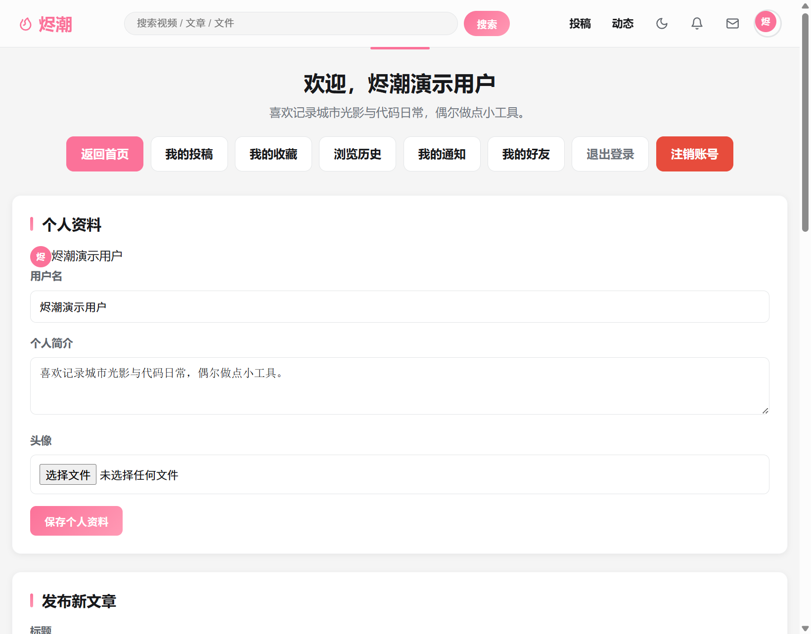 | 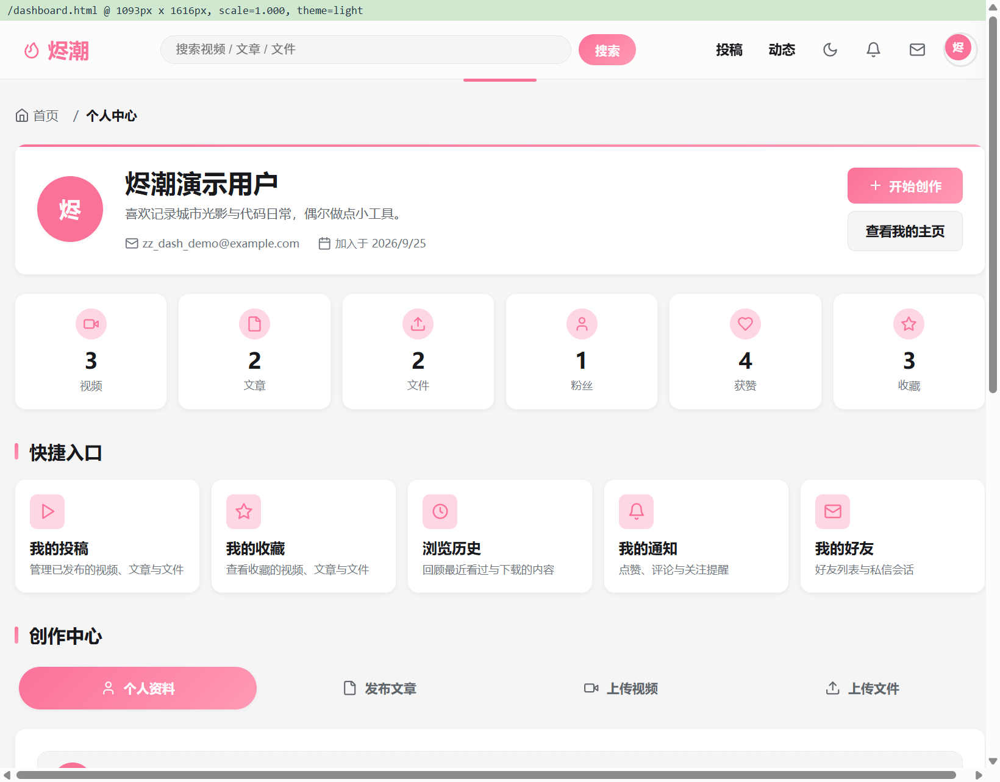 |
| 桌面 · 深色 · 首屏 | 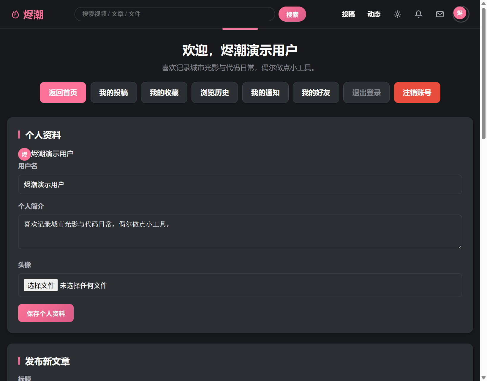 | 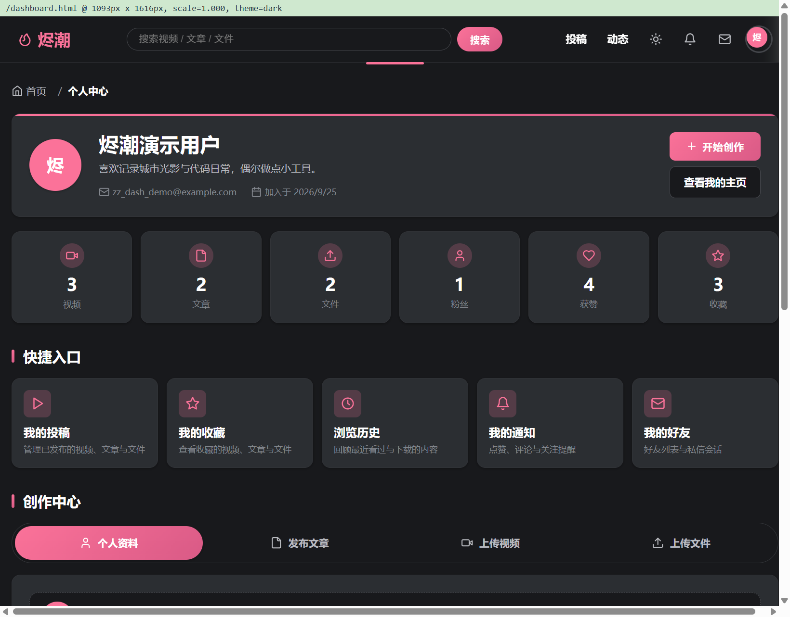 |
| 桌面 · 浅色 · 整页 | 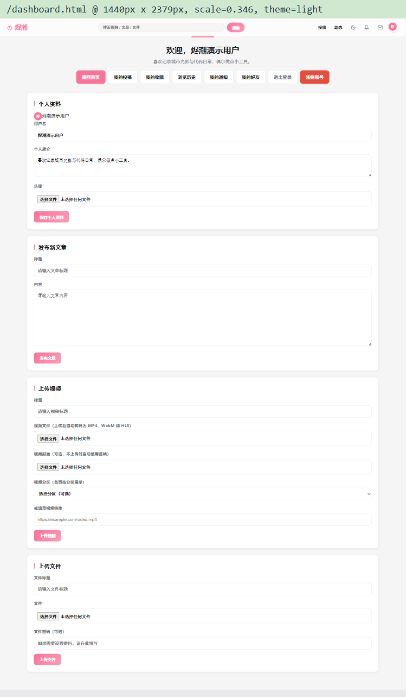 | 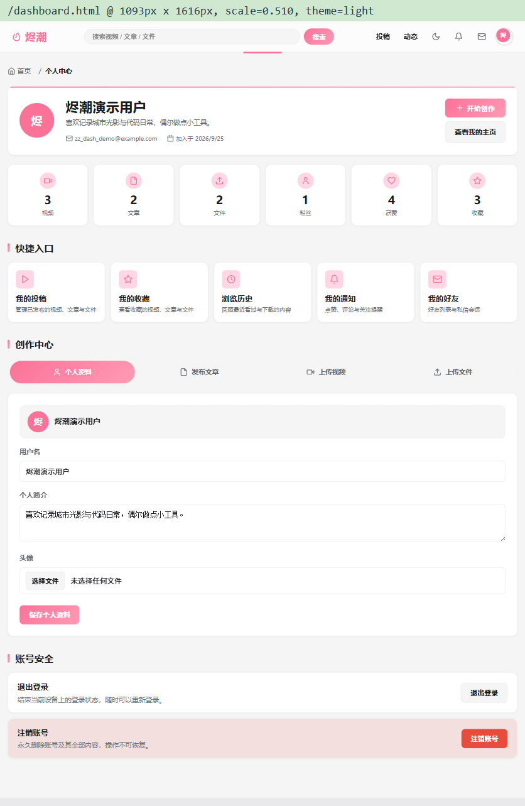 |
| 桌面 · 深色 · 整页 | 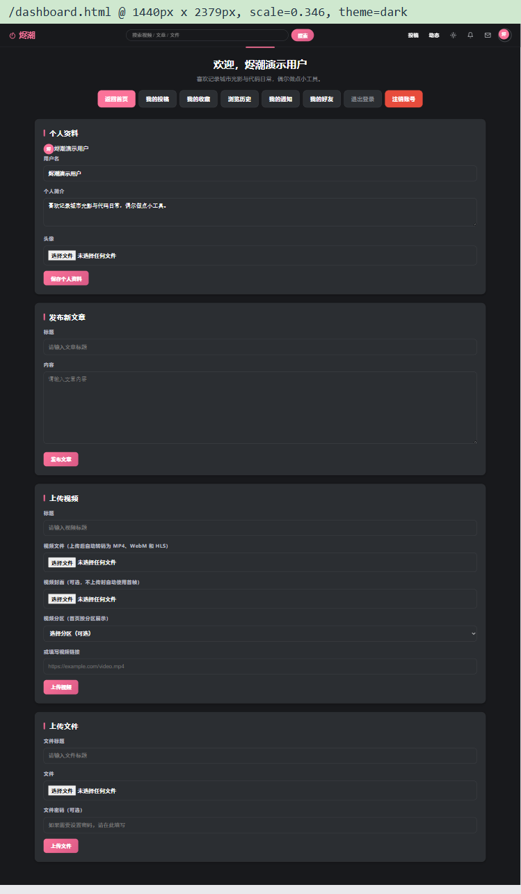 | 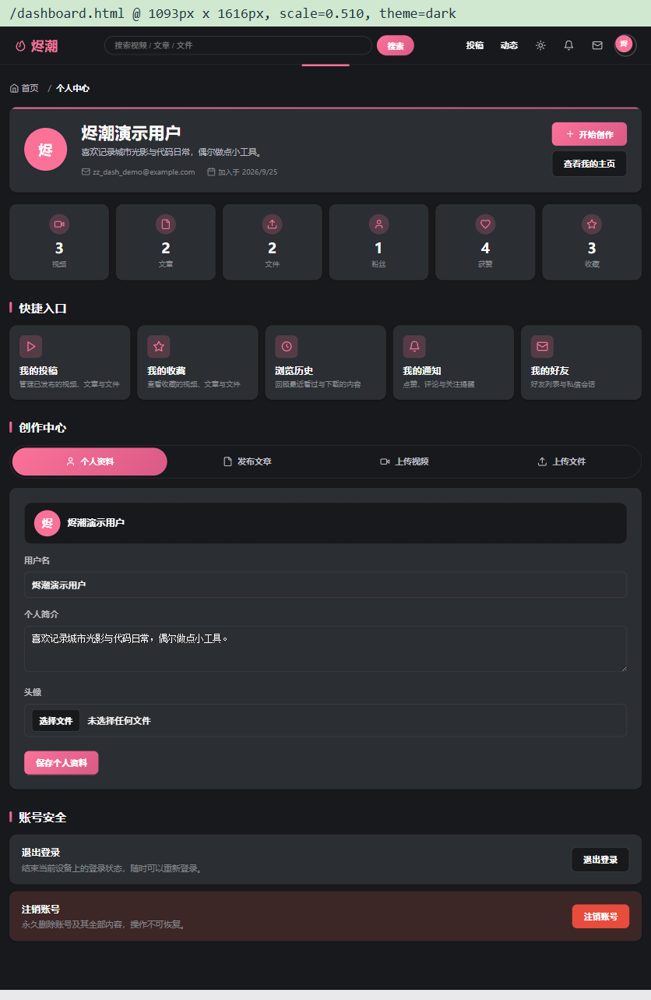 |
| 移动 · 浅色 | 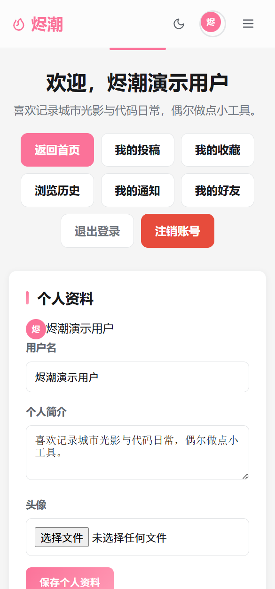 | 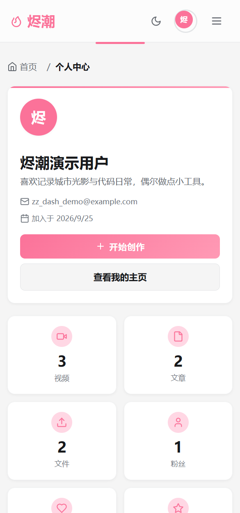 |
| 移动 · 深色 | 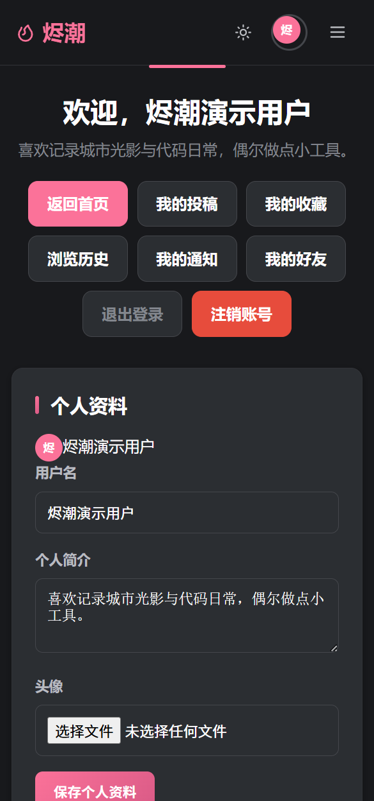 | 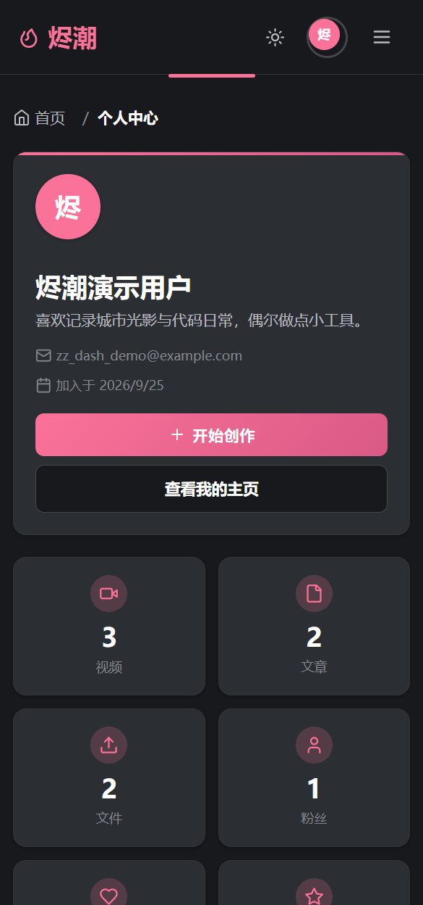 |

> 截图说明：整页图使用同一夹具在 1093px 宽下等比缩放抓取。优化前缩放比 0.457（页面高 1804px），优化后 0.510（页面高 1616px），缩放比变化即页面变短的直接体现。

---

## 六、验证结果

| 验证项 | 结果 |
|---|---|
| 语法检查 | `node --check server.js` / `node --check public/js/app.js` 通过 |
| 单元测试 | `npm test` → 5 passed / 0 failed |
| 静态资源与接口 | `GET /api/user/stats` 返回 `videos:3, posts:2, files:2, followers:1, likes:4, favorites:3`，与数据库实际一致 |
| 横向溢出 | 1440 / 1093 / 1001 / 1000 / 768 / 641 / 640 / 480 / 390 / 360px 下 `scrollWidth === clientWidth`，无横向滚动、无元素越界 |
| 标签页交互 | 点击「发布文章」后 `panel-post` 显示、其余 `hidden`，`aria-selected` 与 `tabindex` 同步正确 |
| 消息过渡 | 调用后 `display:block, opacity:0` → 下一帧 `is-visible, opacity:1` → 3.6s 后 `display:none` |
| 深色模式 | `body.dark` 生效；`.message` 背景 `rgba(52,209,124,.16)` / 边框 `#34d17c` / 文字 `#fff`；文件按钮 `#18191c` 底 + 白字（不再出现系统白底）；统计图标与标签页文字对比度正常 |
| 控制台 | dashboard 页面加载无 JS 报错 |

---

## 七、已知限制与后续建议

1. 统计接口为 5 条独立 `COUNT(*)` 查询 + 1 条联表计数，数据量增大后可合并为单条多子查询 SQL 或加缓存；
2. 获赞数仅统计视频点赞（数据库无 `post_likes` 表），文章点赞未纳入；
3. 「我的投稿」等入口未在卡片内直接展示各自数量，后续可复用 `/api/user/stats` 数据补充；
4. 深色模式目前依赖 `body.dark`，如需支持 `<html>` 级主题或系统主题实时切换，建议把令牌挂到 `:root` 并用 `data-theme` 属性驱动；
5. 上传表单的按钮加载态（提交中禁用 + 文案变更）仍沿用原有实现，未纳入本次优化范围。
